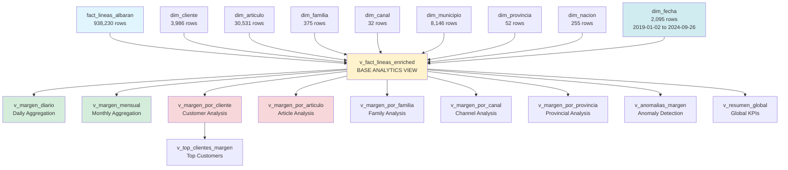

# 📊 CRUZBER Analytics Views Documentation

## Executive Summary

This document describes the **analytics layer** built on top of the `dataset_cruzber` relational database. The layer consists of:

- **1 Calendar Dimension Table** (`dim_fecha`) for date intelligence (2,095 days: 2019-01-02 to 2024-09-26)
- **12 Analytics Views** organized by analysis domain:
  - 1 Enriched fact view (base layer)
  - 2 Time-based aggregation views
  - 3 Customer analysis views
  - 2 Product analysis views
  - 2 Multi-dimensional views (channel, geography)
  - 1 Quality/anomaly detection view
  - 1 Global summary view

### Key Features

✅ **Pre-joined dimensions** for simplified querying  
✅ **BaseImponible-driven margin logic** (authoritative source)  
✅ **Margin validation flags** (consistency checks with 0.01 EUR tolerance)  
✅ **Time intelligence** via calendar dimension  
✅ **Safe division** using NULLIF to prevent division-by-zero  
✅ **Quality metrics** embedded in aggregation views  
✅ **Multi-grain analysis** (daily, monthly, customer, product, channel, geography)

---

## Table of Contents

1. [Architecture Overview](#architecture-overview)
2. [Calendar Dimension: dim_fecha](#calendar-dimension-dim_fecha)
3. [Base View: v_fact_lineas_enriched](#base-view-v_fact_lineas_enriched)
4. [Time Views](#time-views)
5. [Customer Views](#customer-views)
6. [Product Views](#product-views)
7. [Channel & Geography Views](#channel--geography-views)
8. [Quality Views](#quality-views)
9. [Summary Views](#summary-views)
10. [Performance Optimization](#performance-optimization)
11. [Example Queries](#example-queries)
12. [Troubleshooting](#troubleshooting)

---

## Architecture Overview

### Analytics Layer Dependency Diagram



### Design Principles

1. **Layered Architecture**: Base enriched view → Domain-specific aggregations
2. **Single Source of Truth**: All views derive from `v_fact_lineas_enriched`
3. **Idempotency**: All views use `DROP VIEW IF EXISTS` for safe re-creation
4. **Defensive SQL**: NULLIF prevents division-by-zero errors
5. **Quality First**: Margin validation and anomaly flags embedded in base view

---

## Calendar Dimension: dim_fecha

### Purpose

Provide date intelligence for time-based analysis without repetitive date function calls in queries.

### Characteristics

- **Type**: Physical table (not a view)
- **Grain**: One row per calendar day
- **Population**: Auto-generated from `MIN(fecha_albaran)` to `MAX(fecha_albaran)` in fact table
- **Indexes**: Primary key on `fecha`, composite index on `(anio, mes)`

### Schema

| Column | Type | Description |
|--------|------|-------------|
| `fecha` | DATE | Calendar date (PK) |
| `anio` | INT | Year (YYYY) |
| `trimestre` | INT | Quarter (1-4) |
| `mes` | INT | Month (1-12) |
| `mes_nombre` | VARCHAR(20) | Spanish month name (Enero, Febrero, ...) |
| `semana_anio` | INT | ISO week number (1-53) |
| `dia_mes` | INT | Day of month (1-31) |
| `dia_semana` | INT | Day of week (1=Monday, 7=Sunday) |
| `dia_nombre` | VARCHAR(20) | Spanish weekday name (Lunes, Martes, ...) |
| `es_fin_semana` | BOOLEAN | Weekend flag (Saturday/Sunday) |
| `trimestre_nombre` | VARCHAR(10) | Quarter label (T1, T2, T3, T4) |

### Example Queries

```sql
-- Get all Mondays in 2024
SELECT fecha, mes_nombre
FROM dim_fecha
WHERE anio = 2024 AND dia_nombre = 'Lunes';

-- Count trading days per month
SELECT anio, mes, mes_nombre, COUNT(*) as dias_habiles
FROM dim_fecha
WHERE es_fin_semana = 0
GROUP BY anio, mes, mes_nombre;

-- Find all dates in Q1 2024
SELECT fecha
FROM dim_fecha
WHERE anio = 2024 AND trimestre = 1;
```

### Performance Notes

- **Indexed**: Fast lookups on date, year, and year-month combinations
- **Small Size**: Typically 1,000-3,000 rows (3-10 years of dates)
- **No Joins Needed**: Self-contained date attributes eliminate YEAR(), MONTH() function calls

---

## Base View: v_fact_lineas_enriched

### Purpose

Pre-join all dimensions to the fact table and add calculated margin metrics with validation flags. This is the **foundation view** for all downstream analytics.

### Grain

**One row per delivery note line** (same as `fact_lineas_albaran`)

### Key Features

1. **Geographic Hierarchy**: Nacion → Provincia → Municipio → Cliente (4 levels)
2. **Time Intelligence**: Direct join to `dim_fecha` for year, quarter, month, week attributes
3. **Product Hierarchy**: Articulo → Subfamilia → Familia
4. **Channel Attribution**: Cliente → Canal → Agrupacion Canal
5. **Margin Validation**: Compare stored vs. calculated margin with 0.01 EUR tolerance
6. **Quality Flags**: Identify lines with missing or inconsistent data

### Column Categories

#### Primary Keys
- `id_linea`, `numero_albaran`, `numero_linea`

#### Time Dimension (from dim_fecha)
- `fecha_albaran`, `anio`, `trimestre`, `trimestre_nombre`, `mes`, `mes_nombre`
- `semana_anio`, `dia_semana`, `dia_nombre`, `es_fin_semana`

#### Customer Dimension (with geography)
- `codigo_cliente`, `nombre_cliente`, `cliente_fecha_alta`, `cliente_canal`
- `codigo_municipio`, `municipio`, `codigo_provincia`, `provincia`, `codigo_nacion`, `nacion`

#### Channel Dimension
- `agrupacion_canal`, `descripcion_canal`

#### Product Dimensions
- `codigo_articulo`, `descripcion_articulo`
- `codigo_familia`, `codigo_subfamilia`, `descripcion_familia`
- `precio_venta_estandar`, `coste_estandar` (reference prices)

#### Financial Measures (Stored)
- `base_imponible_stored` ← **AUTHORITATIVE NET REVENUE**
- `coste_stored` ← Cost of goods sold
- `margen_stored` ← Stored margin = BaseImponible - Coste
- `por_margen_stored` ← Stored margin %
- `importe_bruto`, `importe_neto`, `importe_liquido` (intermediate amounts)
- `por_descuento`, `por_descuento2`, `por_pronto_pago`, `por_iva` (rates)

#### Financial Measures (Calculated)
- `margen_calc` = `base_imponible_stored - coste_stored`
- `por_margen_calc` = `100.0 * margen_calc / base_imponible_stored` (with NULLIF)
- `margen_delta` = `margen_stored - margen_calc` (for anomaly detection)

#### Quality Flags
- `margen_consistente` (BOOLEAN): TRUE if `|margen_delta| <= 0.01`
- `estado_calidad` (VARCHAR): 
  - `'OK'` = All validations pass
  - `'SIN_BASE_IMPONIBLE'` = BaseImponible is NULL
  - `'BASE_CERO'` = BaseImponible is zero
  - `'SIN_COSTE'` = Coste is NULL
  - `'SIN_MARGEN'` = Margin is NULL
  - `'MARGEN_INCONSISTENTE'` = |margen_delta| > 0.01

#### Derived Metrics
- `precio_unitario_neto` = `base_imponible / unidades`
- `coste_unitario` = `coste / unidades`
- `margen_unitario` = `margen / unidades`

### Example Queries

```sql
-- Get all lines for a specific customer with margin validation
SELECT 
    numero_albaran,
    fecha_albaran,
    descripcion_articulo,
    unidades,
    base_imponible_stored,
    margen_stored,
    por_margen_stored,
    margen_consistente,
    estado_calidad
FROM v_fact_lineas_enriched
WHERE codigo_cliente = 'C001'
ORDER BY fecha_albaran DESC;

-- Find high-margin products in Q1 2024
SELECT 
    codigo_articulo,
    descripcion_articulo,
    descripcion_familia,
    AVG(por_margen_stored) as margen_promedio,
    SUM(base_imponible_stored) as ventas_totales
FROM v_fact_lineas_enriched
WHERE anio = 2024 AND trimestre = 1
GROUP BY codigo_articulo, descripcion_articulo, descripcion_familia
HAVING AVG(por_margen_stored) > 30
ORDER BY ventas_totales DESC;

-- Analyze weekend vs. weekday sales
SELECT 
    es_fin_semana,
    COUNT(*) as num_lineas,
    SUM(base_imponible_stored) as ventas_totales,
    AVG(por_margen_stored) as margen_promedio
FROM v_fact_lineas_enriched
GROUP BY es_fin_semana;
```

### Performance Notes

- **Large View**: Contains same row count as fact table (938,230 rows)
- **Multiple Joins**: 8 LEFT JOINs to dimension tables
- **Recommendation**: Use as base for filtered queries, not full table scans
- **Indexing**: Ensure fact table has indexes on `fecha_albaran`, `codigo_cliente`, `codigo_articulo`

---

## Time Views

### v_margen_diario

#### Purpose
Daily sales and margin aggregation with quality metrics.

#### Grain
**One row per calendar date**

#### Key Columns

| Column | Type | Description |
|--------|------|-------------|
| `fecha` | DATE | Calendar date |
| `anio`, `mes`, `trimestre` | INT | Time attributes |
| `ventas_netas` | DECIMAL | SUM(base_imponible) |
| `coste_total` | DECIMAL | SUM(coste) |
| `margen_total` | DECIMAL | SUM(margen) |
| `por_margen` | DECIMAL | 100 * margen / ventas |
| `num_lineas` | INT | Line count |
| `num_clientes` | INT | DISTINCT customers |
| `num_articulos` | INT | DISTINCT articles |
| `num_albaranes` | INT | DISTINCT delivery notes |
| `ticket_medio_linea` | DECIMAL | AVG revenue per line |
| `ticket_medio_albaran` | DECIMAL | AVG revenue per delivery note |
| `lineas_ok`, `lineas_anomalas` | INT | Quality counts |
| `por_calidad` | DECIMAL | % of lines with OK status |

#### Example Queries

```sql
-- Daily sales trend for last 30 days
SELECT 
    fecha,
    ventas_netas,
    margen_total,
    por_margen,
    num_clientes
FROM v_margen_diario
WHERE fecha >= CURDATE() - INTERVAL 30 DAY
ORDER BY fecha;

-- Find top 10 sales days
SELECT 
    fecha,
    dia_nombre,
    ventas_netas,
    num_clientes,
    num_albaranes
FROM v_margen_diario
ORDER BY ventas_netas DESC
LIMIT 10;

-- Compare weekend vs weekday performance
SELECT 
    YEAR(fecha) as anio,
    es_fin_semana,
    COUNT(*) as dias,
    SUM(ventas_netas) as ventas_totales,
    AVG(ventas_netas) as ventas_promedio_dia
FROM v_margen_diario d
JOIN dim_fecha f ON d.fecha = f.fecha
GROUP BY YEAR(fecha), es_fin_semana;
```

---

### v_margen_mensual

#### Purpose
Monthly sales and margin aggregation with extended metrics.

#### Grain
**One row per year-month**

#### Key Columns

Same as `v_margen_diario` plus:

| Column | Type | Description |
|--------|------|-------------|
| `dias_con_ventas` | INT | Number of days with sales |
| `ventas_diarias_promedio` | DECIMAL | Avg sales per active day |
| `margen_diario_promedio` | DECIMAL | Avg margin per active day |
| `ticket_medio_cliente` | DECIMAL | Total sales / distinct customers |
| `margen_medio_cliente` | DECIMAL | Total margin / distinct customers |
| `ticket_medio_linea` | DECIMAL | AVG(base_imponible) |
| `margen_medio_linea` | DECIMAL | AVG(margen) |

#### Example Queries

```sql
-- Monthly sales trend with year-over-year comparison
SELECT 
    anio,
    mes,
    mes_nombre,
    ventas_netas,
    margen_total,
    por_margen,
    num_clientes
FROM v_margen_mensual
WHERE anio >= 2023
ORDER BY anio, mes;

-- Identify best performing months
SELECT 
    mes,
    mes_nombre,
    AVG(ventas_netas) as ventas_promedio,
    AVG(por_margen) as margen_promedio,
    COUNT(*) as num_años
FROM v_margen_mensual
GROUP BY mes, mes_nombre
ORDER BY ventas_promedio DESC;

-- Monthly growth rate
SELECT 
    anio,
    mes,
    mes_nombre,
    ventas_netas,
    LAG(ventas_netas) OVER (ORDER BY anio, mes) as ventas_mes_anterior,
    100.0 * (ventas_netas - LAG(ventas_netas) OVER (ORDER BY anio, mes)) / 
        NULLIF(LAG(ventas_netas) OVER (ORDER BY anio, mes), 0) as crecimiento_pct
FROM v_margen_mensual
ORDER BY anio DESC, mes DESC
LIMIT 12;
```

---

## Customer Views

### v_margen_por_cliente

#### Purpose
Customer-level lifetime value analysis with RFM-style metrics.

#### Grain
**One row per customer**

#### Key Columns

| Column | Type | Description |
|--------|------|-------------|
| `codigo_cliente` | VARCHAR | Customer code (PK) |
| `nombre_cliente` | VARCHAR | Customer name |
| `provincia`, `nacion` | VARCHAR | Geographic location |
| `canal_venta`, `agrupacion_canal` | VARCHAR | Sales channel |
| `ventas_netas` | DECIMAL | Lifetime revenue |
| `margen_total` | DECIMAL | Lifetime margin |
| `por_margen` | DECIMAL | Margin % |
| `num_lineas` | INT | Total order lines |
| `articulos_distintos` | INT | Product variety |
| `num_albaranes` | INT | Order count |
| `primera_venta` | DATE | First purchase date |
| `ultima_venta` | DATE | Last purchase date |
| `dias_activo` | INT | Days between first and last purchase |
| `dias_con_compras` | INT | Number of distinct purchase days |
| `dias_desde_ultima_compra` | INT | Recency (days since last order) |
| `ticket_medio_linea` | DECIMAL | Avg revenue per line |
| `ticket_medio_albaran` | DECIMAL | Avg revenue per order |
| `por_calidad` | DECIMAL | % of OK lines |

#### Example Queries

```sql
-- Top 50 customers by lifetime value
SELECT 
    codigo_cliente,
    nombre_cliente,
    provincia,
    ventas_netas,
    margen_total,
    por_margen,
    num_albaranes,
    ultima_venta,
    dias_desde_ultima_compra
FROM v_margen_por_cliente
ORDER BY ventas_netas DESC
LIMIT 50;

-- At-risk customers (no purchase in 90+ days)
SELECT 
    codigo_cliente,
    nombre_cliente,
    ultima_venta,
    dias_desde_ultima_compra,
    ventas_netas,
    margen_total
FROM v_margen_por_cliente
WHERE dias_desde_ultima_compra > 90
ORDER BY ventas_netas DESC;

-- RFM Analysis (Recency, Frequency, Monetary)
SELECT 
    CASE 
        WHEN dias_desde_ultima_compra <= 30 THEN 'Hot'
        WHEN dias_desde_ultima_compra <= 90 THEN 'Warm'
        ELSE 'Cold'
    END as recency_segment,
    CASE 
        WHEN num_albaranes >= 50 THEN 'High Frequency'
        WHEN num_albaranes >= 10 THEN 'Medium Frequency'
        ELSE 'Low Frequency'
    END as frequency_segment,
    CASE 
        WHEN ventas_netas >= 10000 THEN 'High Value'
        WHEN ventas_netas >= 1000 THEN 'Medium Value'
        ELSE 'Low Value'
    END as monetary_segment,
    COUNT(*) as num_clientes,
    SUM(ventas_netas) as ventas_totales,
    AVG(por_margen) as margen_promedio
FROM v_margen_por_cliente
GROUP BY recency_segment, frequency_segment, monetary_segment
ORDER BY ventas_totales DESC;
```

---

### v_top_clientes_margen

#### Purpose
Pre-filtered view of customers with non-null margin for ranking queries.

#### Grain
**One row per customer** (subset of `v_margen_por_cliente`)

#### Usage Pattern

```sql
-- Top 50 by margin (apply ORDER BY in query)
SELECT * 
FROM v_top_clientes_margen
ORDER BY margen_total DESC
LIMIT 50;

-- Top 20 by revenue in specific province
SELECT * 
FROM v_top_clientes_margen
WHERE provincia = 'Madrid'
ORDER BY ventas_netas DESC
LIMIT 20;

-- Top customers by margin percentage (min 1000 EUR revenue)
SELECT 
    codigo_cliente,
    nombre_cliente,
    ventas_netas,
    margen_total,
    por_margen
FROM v_top_clientes_margen
WHERE ventas_netas >= 1000
ORDER BY por_margen DESC
LIMIT 50;
```

#### Notes

- MySQL views don't enforce ORDER BY during view creation
- Apply ORDER BY + LIMIT in the SELECT query consuming the view
- View pre-filters `margen_total IS NOT NULL` for efficiency

---

## Product Views

### v_margen_por_articulo

#### Purpose
Article-level profitability analysis.

#### Grain
**One row per article**

#### Key Columns

| Column | Type | Description |
|--------|------|-------------|
| `codigo_articulo` | VARCHAR | Article code (PK) |
| `descripcion_articulo` | VARCHAR | Article description |
| `codigo_familia`, `descripcion_familia` | VARCHAR | Product family |
| `precio_venta_estandar`, `coste_estandar` | DECIMAL | Standard prices |
| `ventas_netas` | DECIMAL | Total revenue |
| `margen_total` | DECIMAL | Total margin |
| `por_margen` | DECIMAL | Margin % |
| `num_lineas` | INT | Order lines |
| `unidades_totales` | INT | Units sold |
| `clientes_distintos` | INT | Customer reach |
| `primera_venta`, `ultima_venta` | DATE | Lifecycle dates |
| `dias_con_ventas` | INT | Active days |
| `precio_unitario_promedio` | DECIMAL | Actual avg price |
| `coste_unitario_promedio` | DECIMAL | Actual avg cost |
| `margen_unitario_promedio` | DECIMAL | Actual unit margin |
| `por_calidad` | DECIMAL | % OK lines |

#### Example Queries

```sql
-- Top 100 products by revenue
SELECT 
    codigo_articulo,
    descripcion_articulo,
    descripcion_familia,
    ventas_netas,
    margen_total,
    por_margen,
    unidades_totales
FROM v_margen_por_articulo
ORDER BY ventas_netas DESC
LIMIT 100;

-- Find high-margin, low-volume products (opportunity analysis)
SELECT 
    codigo_articulo,
    descripcion_articulo,
    por_margen,
    unidades_totales,
    clientes_distintos,
    ventas_netas
FROM v_margen_por_articulo
WHERE por_margen > 30 
  AND unidades_totales < 100
  AND ventas_netas > 1000
ORDER BY por_margen DESC;

-- Compare actual vs standard pricing
SELECT 
    codigo_articulo,
    descripcion_articulo,
    precio_venta_estandar,
    precio_unitario_promedio,
    100.0 * (precio_unitario_promedio - precio_venta_estandar) / 
        NULLIF(precio_venta_estandar, 0) as desviacion_precio_pct,
    unidades_totales
FROM v_margen_por_articulo
WHERE precio_venta_estandar > 0
ORDER BY ABS(desviacion_precio_pct) DESC
LIMIT 50;
```

---

### v_margen_por_familia

#### Purpose
Product family/subfamily profitability analysis.

#### Grain
**One row per (familia, subfamilia) combination**

#### Key Columns

| Column | Type | Description |
|--------|------|-------------|
| `codigo_familia` | VARCHAR | Family code (part of PK) |
| `codigo_subfamilia` | VARCHAR | Subfamily code (part of PK) |
| `descripcion_familia` | VARCHAR | Family description |
| `ventas_netas`, `margen_total`, `por_margen` | DECIMAL | Financials |
| `num_lineas`, `unidades_totales` | INT | Volume |
| `articulos_distintos` | INT | Product variety |
| `clientes_distintos` | INT | Customer reach |
| `ventas_promedio_por_articulo` | DECIMAL | Revenue per article |
| `margen_promedio_por_articulo` | DECIMAL | Margin per article |

#### Example Queries

```sql
-- Family-level margin analysis
SELECT 
    codigo_familia,
    descripcion_familia,
    COUNT(*) as num_subfamilias,
    SUM(ventas_netas) as ventas_totales,
    SUM(margen_total) as margen_total,
    100.0 * SUM(margen_total) / NULLIF(SUM(ventas_netas), 0) as por_margen,
    SUM(articulos_distintos) as total_articulos
FROM v_margen_por_familia
GROUP BY codigo_familia, descripcion_familia
ORDER BY ventas_totales DESC;

-- Subfamily performance within a family
SELECT 
    codigo_subfamilia,
    ventas_netas,
    margen_total,
    por_margen,
    articulos_distintos,
    clientes_distintos
FROM v_margen_por_familia
WHERE codigo_familia = 'FAM001'
ORDER BY ventas_netas DESC;

-- Identify underperforming families (low margin %)
SELECT 
    codigo_familia,
    descripcion_familia,
    ventas_netas,
    por_margen,
    articulos_distintos
FROM v_margen_por_familia
WHERE ventas_netas > 5000
HAVING AVG(por_margen) < 15
ORDER BY ventas_netas DESC;
```

---

## Channel & Geography Views

### v_margen_por_canal

#### Purpose
Sales channel performance analysis.

#### Grain
**One row per channel grouping** (`agrupacion_canal`)

#### Key Columns

| Column | Type | Description |
|--------|------|-------------|
| `agrupacion_canal` | VARCHAR | Channel grouping (PK) |
| `descripcion_canal` | VARCHAR | Channel description |
| `ventas_netas`, `margen_total`, `por_margen` | DECIMAL | Financials |
| `num_lineas`, `unidades_totales` | INT | Volume |
| `clientes_distintos` | INT | Customer count |
| `articulos_distintos` | INT | Product variety |
| `ventas_promedio_por_cliente` | DECIMAL | ARPC |
| `margen_promedio_por_cliente` | DECIMAL | Margin per customer |

#### Example Queries

```sql
-- Channel comparison
SELECT 
    agrupacion_canal,
    ventas_netas,
    margen_total,
    por_margen,
    clientes_distintos,
    ventas_promedio_por_cliente
FROM v_margen_por_canal
ORDER BY ventas_netas DESC;

-- Channel profitability ranking
SELECT 
    agrupacion_canal,
    100.0 * ventas_netas / SUM(ventas_netas) OVER () as pct_ventas,
    100.0 * margen_total / SUM(margen_total) OVER () as pct_margen,
    por_margen
FROM v_margen_por_canal
ORDER BY margen_total DESC;
```

---

### v_margen_por_provincia

#### Purpose
Geographic profitability analysis by province.

#### Grain
**One row per province**

#### Key Columns

| Column | Type | Description |
|--------|------|-------------|
| `codigo_provincia` | VARCHAR | Province code (PK) |
| `provincia` | VARCHAR | Province name |
| `codigo_nacion`, `nacion` | VARCHAR | Country |
| `ventas_netas`, `margen_total`, `por_margen` | DECIMAL | Financials |
| `clientes_distintos` | INT | Customer count |
| `municipios_activos` | INT | Active municipalities |
| `ventas_promedio_por_cliente` | DECIMAL | ARPC |

#### Example Queries

```sql
-- Top 10 provinces by revenue
SELECT 
    provincia,
    nacion,
    ventas_netas,
    margen_total,
    clientes_distintos,
    municipios_activos
FROM v_margen_por_provincia
ORDER BY ventas_netas DESC
LIMIT 10;

-- Geographic diversification (Herfindahl index)
SELECT 
    SUM(POWER(ventas_netas / SUM(ventas_netas) OVER (), 2)) as herfindahl_index,
    COUNT(*) as num_provincias
FROM v_margen_por_provincia;
```

---

## Quality Views

### v_anomalias_margen

#### Purpose
Identify and categorize margin calculation anomalies for data quality monitoring.

#### Grain
**One row per anomalous line** (subset of fact table)

#### Key Columns

| Column | Type | Description |
|--------|------|-------------|
| `id_linea`, `numero_albaran` | VARCHAR | Line identifiers |
| `fecha_albaran` | DATE | Transaction date |
| `codigo_cliente`, `nombre_cliente` | VARCHAR | Customer info |
| `codigo_articulo`, `descripcion_articulo` | VARCHAR | Product info |
| `base_imponible_stored`, `coste_stored` | DECIMAL | Stored values |
| `margen_stored`, `por_margen_stored` | DECIMAL | Stored margin |
| `margen_calc`, `por_margen_calc` | DECIMAL | Calculated margin |
| `margen_delta` | DECIMAL | margen_stored - margen_calc |
| `margen_consistente` | BOOLEAN | Consistency flag |
| `estado_calidad` | VARCHAR | Quality status code |
| `severidad` | VARCHAR | Severity level |
| `descripcion_anomalia` | VARCHAR | Human-readable description |

#### Quality Status Codes

| Code | Meaning | Severity |
|------|---------|----------|
| `SIN_BASE_IMPONIBLE` | BaseImponible is NULL | CRITICAL |
| `BASE_CERO` | BaseImponible is zero | CRITICAL |
| `SIN_COSTE` | Coste is NULL | WARNING |
| `SIN_MARGEN` | Margin is NULL | WARNING |
| `MARGEN_INCONSISTENTE` | \|delta\| > 0.01 EUR | ERROR |

#### Example Queries

```sql
-- Count anomalies by type
SELECT 
    estado_calidad,
    COUNT(*) as num_casos,
    100.0 * COUNT(*) / SUM(COUNT(*)) OVER () as pct_total
FROM v_anomalias_margen
GROUP BY estado_calidad
ORDER BY num_casos DESC;

-- Critical anomalies (missing BaseImponible)
SELECT 
    numero_albaran,
    fecha_albaran,
    codigo_cliente,
    nombre_cliente,
    descripcion_anomalia
FROM v_anomalias_margen
WHERE estado_calidad IN ('SIN_BASE_IMPONIBLE', 'BASE_CERO')
ORDER BY fecha_albaran DESC
LIMIT 50;

-- Largest margin discrepancies
SELECT 
    numero_albaran,
    numero_linea,
    codigo_articulo,
    base_imponible_stored,
    margen_stored,
    margen_calc,
    margen_delta,
    descripcion_anomalia
FROM v_anomalias_margen
WHERE estado_calidad = 'MARGEN_INCONSISTENTE'
ORDER BY ABS(margen_delta) DESC
LIMIT 20;

-- Anomaly trend over time
SELECT 
    DATE_FORMAT(fecha_albaran, '%Y-%m') as mes,
    COUNT(*) as total_anomalias,
    SUM(CASE WHEN estado_calidad IN ('SIN_BASE_IMPONIBLE', 'BASE_CERO') THEN 1 ELSE 0 END) as criticas,
    SUM(CASE WHEN estado_calidad = 'MARGEN_INCONSISTENTE' THEN 1 ELSE 0 END) as inconsistencias
FROM v_anomalias_margen
GROUP BY DATE_FORMAT(fecha_albaran, '%Y-%m')
ORDER BY mes DESC;
```

---

## Summary Views

### v_resumen_global

#### Purpose
Single-row global KPIs for dashboard headers and executive summaries.

#### Grain
**One row** (entire database)

#### Key Columns

| Column | Type | Description |
|--------|------|-------------|
| `total_lineas` | INT | Total order lines |
| `total_albaranes` | INT | Total delivery notes |
| `total_clientes` | INT | Total customers |
| `total_articulos` | INT | Total articles |
| `total_provincias` | INT | Geographic reach |
| `fecha_inicio`, `fecha_fin` | DATE | Date range |
| `dias_periodo` | INT | Period length |
| `ventas_netas_total` | DECIMAL | Total revenue |
| `coste_total`, `margen_total` | DECIMAL | Total cost & margin |
| `por_margen_global` | DECIMAL | Global margin % |
| `unidades_totales` | INT | Total units sold |
| `ticket_medio_linea` | DECIMAL | Avg line value |
| `ticket_medio_albaran` | DECIMAL | Avg order value |
| `ventas_promedio_cliente` | DECIMAL | Revenue per customer |
| `lineas_ok`, `lineas_anomalas` | INT | Quality counts |
| `por_calidad_global` | DECIMAL | % OK lines |
| `fecha_calculo` | DATE | Report date |

#### Example Queries

```sql
-- Dashboard header KPIs
SELECT 
    FORMAT(ventas_netas_total, 2) as ventas_totales_eur,
    FORMAT(margen_total, 2) as margen_total_eur,
    ROUND(por_margen_global, 1) as margen_pct,
    FORMAT(total_clientes, 0) as num_clientes,
    FORMAT(total_articulos, 0) as num_articulos,
    ROUND(por_calidad_global, 1) as calidad_pct,
    fecha_inicio,
    fecha_fin
FROM v_resumen_global;

-- Compare to subset (e.g., last 12 months)
SELECT 
    'Global' as periodo,
    ventas_netas_total,
    margen_total,
    por_margen_global
FROM v_resumen_global

UNION ALL

SELECT 
    'Last 12M' as periodo,
    SUM(base_imponible_stored) as ventas,
    SUM(margen_stored) as margen,
    100.0 * SUM(margen_stored) / NULLIF(SUM(base_imponible_stored), 0) as pct_margen
FROM v_fact_lineas_enriched
WHERE fecha_albaran >= CURDATE() - INTERVAL 12 MONTH;
```

---

## Performance Optimization

### Recommended Indexes on fact_lineas_albaran

The following indexes significantly improve query performance for the analytics views:

```sql
-- Time-based queries (daily/monthly views)
ALTER TABLE fact_lineas_albaran 
ADD INDEX idx_fact_fecha (fecha_albaran);

-- Customer-based queries (customer views)
ALTER TABLE fact_lineas_albaran 
ADD INDEX idx_fact_cliente (codigo_cliente);

-- Product-based queries (article/family views)
ALTER TABLE fact_lineas_albaran 
ADD INDEX idx_fact_articulo (codigo_articulo);

-- Customer time-series (trend analysis)
ALTER TABLE fact_lineas_albaran 
ADD INDEX idx_fact_fecha_cliente (fecha_albaran, codigo_cliente);

-- Product time-series (trend analysis)
ALTER TABLE fact_lineas_albaran 
ADD INDEX idx_fact_fecha_articulo (fecha_albaran, codigo_articulo);

-- Delivery note lookups
ALTER TABLE fact_lineas_albaran 
ADD INDEX idx_fact_albaran (numero_albaran);
```

### Query Performance Tips

1. **Filter Early**: Apply WHERE clauses on indexed columns before aggregation
2. **Limit Joins**: Use pre-aggregated views when possible (e.g., `v_margen_mensual` instead of `v_fact_lineas_enriched` for monthly reports)
3. **Use LIMIT**: Always limit result sets for exploratory queries
4. **Covering Indexes**: Consider composite indexes that include commonly selected columns
5. **InnoDB Buffer Pool**: Increase `innodb_buffer_pool_size` for large fact tables (recommend 70% of RAM)
6. **Analyze Tables**: Run `ANALYZE TABLE` periodically to update statistics

### Expected Query Times

Based on standard hardware (4 CPU cores, 16 GB RAM, SSD):

| View | Row Count | Typical Query Time |
|------|-----------|-------------------|
| v_fact_lineas_enriched | 938,230 | Full scan: 2-5s, Indexed: 10-500ms |
| v_margen_diario | ~1,000 | 50-200ms |
| v_margen_mensual | ~36 | <50ms |
| v_margen_por_cliente | 3,986 | 100-500ms |
| v_margen_por_articulo | 30,531 | 500ms-2s |
| v_margen_por_familia | ~100 | <100ms |
| v_anomalias_margen | <1,000 | 100-500ms |
| v_resumen_global | 1 | 2-5s (full agg) |

---

## Example Queries

### Business Intelligence Scenarios

#### 1. Monthly Sales Dashboard

```sql
-- Last 12 months performance with MoM growth
WITH monthly_metrics AS (
    SELECT 
        anio,
        mes,
        mes_nombre,
        ventas_netas,
        margen_total,
        por_margen,
        num_clientes,
        LAG(ventas_netas) OVER (ORDER BY anio, mes) as ventas_mes_anterior
    FROM v_margen_mensual
    WHERE anio >= YEAR(CURDATE() - INTERVAL 12 MONTH)
)
SELECT 
    mes_nombre,
    FORMAT(ventas_netas, 2) as ventas_eur,
    FORMAT(margen_total, 2) as margen_eur,
    ROUND(por_margen, 1) as margen_pct,
    num_clientes,
    CASE 
        WHEN ventas_mes_anterior IS NULL THEN NULL
        ELSE ROUND(100.0 * (ventas_netas - ventas_mes_anterior) / ventas_mes_anterior, 1)
    END as crecimiento_pct
FROM monthly_metrics
ORDER BY anio DESC, mes DESC;
```

#### 2. Customer Segmentation (RFM)

```sql
-- RFM segmentation with quintiles
WITH rfm AS (
    SELECT 
        codigo_cliente,
        nombre_cliente,
        dias_desde_ultima_compra,
        num_albaranes,
        ventas_netas,
        NTILE(5) OVER (ORDER BY dias_desde_ultima_compra DESC) as recency_score,
        NTILE(5) OVER (ORDER BY num_albaranes) as frequency_score,
        NTILE(5) OVER (ORDER BY ventas_netas) as monetary_score
    FROM v_margen_por_cliente
)
SELECT 
    recency_score + frequency_score + monetary_score as rfm_score,
    COUNT(*) as num_clientes,
    SUM(ventas_netas) as ventas_totales,
    AVG(ventas_netas) as ventas_promedio,
    CASE 
        WHEN recency_score >= 4 AND frequency_score >= 4 AND monetary_score >= 4 THEN 'Champions'
        WHEN recency_score >= 3 AND frequency_score >= 3 THEN 'Loyal'
        WHEN recency_score >= 4 THEN 'Promising'
        WHEN frequency_score <= 2 AND monetary_score <= 2 THEN 'At Risk'
        ELSE 'Others'
    END as segmento
FROM rfm
GROUP BY rfm_score, segmento
ORDER BY rfm_score DESC;
```

#### 3. Product Portfolio Matrix (BCG-style)

```sql
-- BCG Matrix: Stars, Cash Cows, Question Marks, Dogs
WITH product_metrics AS (
    SELECT 
        codigo_articulo,
        descripcion_articulo,
        descripcion_familia,
        ventas_netas,
        por_margen,
        unidades_totales,
        -- Market share proxy: % of total revenue
        100.0 * ventas_netas / SUM(ventas_netas) OVER () as cuota_mercado,
        -- Growth proxy: % change vs prior year
        (ventas_netas - LAG(ventas_netas) OVER (PARTITION BY codigo_articulo ORDER BY YEAR(ultima_venta))) / 
            NULLIF(LAG(ventas_netas) OVER (PARTITION BY codigo_articulo ORDER BY YEAR(ultima_venta)), 0) * 100 as crecimiento_anual
    FROM v_margen_por_articulo
)
SELECT 
    codigo_articulo,
    descripcion_articulo,
    ventas_netas,
    ROUND(cuota_mercado, 2) as cuota_pct,
    ROUND(crecimiento_anual, 1) as crecimiento_pct,
    CASE 
        WHEN cuota_mercado > 1 AND crecimiento_anual > 10 THEN 'Star'
        WHEN cuota_mercado > 1 AND crecimiento_anual <= 10 THEN 'Cash Cow'
        WHEN cuota_mercado <= 1 AND crecimiento_anual > 10 THEN 'Question Mark'
        ELSE 'Dog'
    END as categoria_bcg
FROM product_metrics
ORDER BY ventas_netas DESC
LIMIT 100;
```

#### 4. Churn Risk Analysis

```sql
-- Customers at risk of churn (90+ days inactive with high historical value)
SELECT 
    c.codigo_cliente,
    c.nombre_cliente,
    c.provincia,
    c.agrupacion_canal,
    c.ultima_venta,
    c.dias_desde_ultima_compra,
    c.ventas_netas as ltv,
    c.num_albaranes as frecuencia_historica,
    c.ticket_medio_albaran,
    -- Churn risk score (0-100)
    LEAST(100, c.dias_desde_ultima_compra * 0.5 + 
          (365 / NULLIF(c.dias_activo, 0) * c.num_albaranes) * 2) as riesgo_churn
FROM v_margen_por_cliente c
WHERE c.dias_desde_ultima_compra > 90
  AND c.ventas_netas > 5000
ORDER BY riesgo_churn DESC, ventas_netas DESC
LIMIT 50;
```

#### 5. Geographic Expansion Opportunities

```sql
-- Identify provinces with high revenue per customer (expansion potential)
SELECT 
    p.provincia,
    p.nacion,
    p.clientes_distintos,
    p.ventas_netas,
    p.ventas_promedio_por_cliente,
    p.por_margen,
    -- Compare to national average
    p.ventas_promedio_por_cliente / AVG(p.ventas_promedio_por_cliente) OVER () as ratio_vs_promedio,
    -- Potential: high ARPC but low customer count
    CASE 
        WHEN p.ventas_promedio_por_cliente > AVG(p.ventas_promedio_por_cliente) OVER () * 1.2 
         AND p.clientes_distintos < 50 THEN 'High Potential'
        WHEN p.ventas_promedio_por_cliente > AVG(p.ventas_promedio_por_cliente) OVER ()
         AND p.clientes_distintos >= 50 THEN 'Mature Market'
        ELSE 'Developing'
    END as clasificacion_mercado
FROM v_margen_por_provincia p
WHERE p.clientes_distintos > 5
ORDER BY ratio_vs_promedio DESC;
```

---

## Troubleshooting

### Common Issues

#### 1. Views Return No Data

**Symptom**: `SELECT * FROM v_margen_diario` returns 0 rows

**Causes**:
- Fact table is empty
- dim_fecha not populated
- Date range mismatch

**Solution**:
```sql
-- Check fact table
SELECT COUNT(*) FROM fact_lineas_albaran;

-- Check dim_fecha range
SELECT MIN(fecha), MAX(fecha) FROM dim_fecha;

-- Check fact date range
SELECT MIN(fecha_albaran), MAX(fecha_albaran) FROM fact_lineas_albaran;

-- Repopulate dim_fecha if needed
DELETE FROM dim_fecha;
-- Then re-run the INSERT from views script
```

#### 2. Slow Query Performance

**Symptom**: Queries take >10 seconds

**Causes**:
- Missing indexes
- Outdated table statistics
- Large result sets without LIMIT

**Solution**:
```sql
-- Check existing indexes
SHOW INDEX FROM fact_lineas_albaran;

-- Add recommended indexes (see Performance section)

-- Update statistics
ANALYZE TABLE fact_lineas_albaran;
ANALYZE TABLE dim_cliente;
ANALYZE TABLE dim_articulo;

-- Always use LIMIT for exploratory queries
SELECT * FROM v_fact_lineas_enriched LIMIT 1000;
```

#### 3. Margin Inconsistency Warnings

**Symptom**: High count in `v_anomalias_margen`

**Causes**:
- Data quality issues in source XLSX
- Parser logic bugs
- Currency rounding differences

**Solution**:
```sql
-- Analyze anomaly distribution
SELECT 
    estado_calidad,
    COUNT(*) as casos,
    MIN(ABS(margen_delta)) as min_delta,
    MAX(ABS(margen_delta)) as max_delta,
    AVG(ABS(margen_delta)) as avg_delta
FROM v_anomalias_margen
GROUP BY estado_calidad;

-- If delta is consistently small (<0.05), adjust tolerance in view
-- If delta is large, investigate source data quality
```

#### 4. Division by Zero Errors

**Symptom**: Error: "Division by zero"

**Cause**: NULLIF not used correctly in custom queries

**Solution**:
Always use NULLIF when dividing:
```sql
-- WRONG
SELECT SUM(margen) / SUM(ventas) FROM ...

-- CORRECT
SELECT SUM(margen) / NULLIF(SUM(ventas), 0) FROM ...
```

#### 5. Calendar Dimension Out of Date

**Symptom**: Recent dates missing from time views

**Solution**:
```sql
-- Check dim_fecha coverage
SELECT MAX(fecha) FROM dim_fecha;

-- If outdated, extend the date range
INSERT INTO dim_fecha (fecha, anio, trimestre, mes, mes_nombre, ...)
-- Add recursive date generation for new range
-- Or re-run the full dim_fecha population from views script
```

---

## Maintenance & Updates

### Regenerating Views

To update all views after schema changes:

```bash
# Backup current views (optional)
mysqldump -u root -p --no-data --routines dataset_cruzber > views_backup.sql

# Apply updated views script
mysql -u root -p dataset_cruzber < sql/views_dataset_cruzber_mysql8.sql
```

### Adding Custom Views

Template for new custom views:

```sql
DROP VIEW IF EXISTS v_custom_analysis;

CREATE VIEW v_custom_analysis AS
SELECT
    -- Your custom logic here
    ...
FROM v_fact_lineas_enriched
WHERE ...
GROUP BY ...;
```

### Monitoring Data Quality

Schedule regular quality checks:

```sql
-- Daily quality report
SELECT 
    CURDATE() as fecha_reporte,
    (SELECT COUNT(*) FROM v_anomalias_margen) as anomalias_detectadas,
    (SELECT por_calidad_global FROM v_resumen_global) as pct_calidad,
    (SELECT COUNT(*) FROM v_margen_diario WHERE fecha = CURDATE() - INTERVAL 1 DAY) as ventas_ayer
FROM DUAL;
```

---

## Appendix: View Dependencies

### Dependency Chain

```
Physical Tables
└── fact_lineas_albaran
└── dim_cliente → dim_municipio → dim_provincia → dim_nacion
└── dim_articulo → dim_familia
└── dim_canal
└── dim_fecha (generated)

Base Analytics View
└── v_fact_lineas_enriched
    ├── Joins all dimensions
    ├── Adds calculated margin metrics
    └── Adds quality flags

Aggregation Views (depend on v_fact_lineas_enriched)
├── v_margen_diario (time)
├── v_margen_mensual (time)
├── v_margen_por_cliente (customer)
│   └── v_top_clientes_margen (customer subset)
├── v_margen_por_articulo (product)
├── v_margen_por_familia (product)
├── v_margen_por_canal (channel)
├── v_margen_por_provincia (geography)
├── v_anomalias_margen (quality)
└── v_resumen_global (summary)
```

### View Recreation Order

When recreating views, follow this order:

1. **dim_fecha** (physical table)
2. **v_fact_lineas_enriched** (base view)
3. All other views (order-independent since they only depend on enriched view)

---

## Conclusion

This analytics layer provides:

✅ **12 pre-built views** covering common BI scenarios  
✅ **Calendar dimension** for time intelligence  
✅ **Margin validation** with quality flags  
✅ **Multi-grain analysis** (daily, monthly, customer, product, channel, geography)  
✅ **Performance-optimized** with indexing recommendations  
✅ **Anomaly detection** for data quality monitoring  

### Next Steps

1. **Import views**: Run `sql/views_dataset_cruzber_mysql8.sql`
2. **Add indexes**: Uncomment index statements in script
3. **Connect BI tool**: Use views as data sources in Power BI/Tableau/Metabase
4. **Build dashboards**: Leverage pre-aggregated views for fast visualization
5. **Schedule quality checks**: Monitor `v_anomalias_margen` daily

---

**Document Version**: 1.0  
**Last Updated**: 2025-12-20  
**Database**: dataset_cruzber  
**Target**: MySQL 8.0.49  
**Views**: 12 + 1 calendar table  
**Author**: Data Engineering Team
